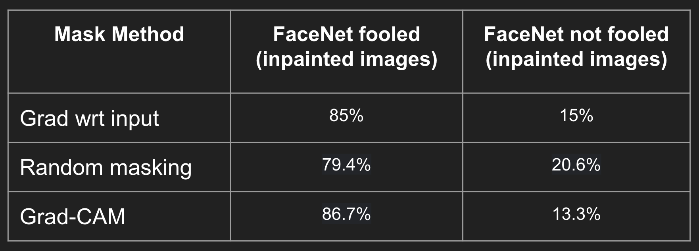

# Seeing Is Not Believing! 
## Privacy preservation using intelligent masking and inpainting using stable diffusion

Models get exposed to a large amount of data to solve
tasks during the training process. This creates a need for
people to be confident in sharing data. However, data that
contains private information should not be accessible to any
party apart from the owner. In this project, we develop a
novel solution which can be applied to vision based tasks
for preserving privacy whilst ensuring that non-private in-
formation is not lost for accomplishing other downstream
tasks. We experiment with various masking techniques to
adversarially create masks and identify salient private fea-
tures. We further inpaint the masked regions to create non-
private representations of the input image using latent dif-
fusion models.


#### Installation Guide
To install all the dependencies required to run the generation pipeline, create a python environment and install all the requirements
```
conda create --name myenv
pip install -r requirements.txt
```

#### Fine-tuning FaceNet

[FaceNet](https://github.com/timesler/facenet-pytorch) models available publicly are trained on the VGGFace2 and CASIA-webface datasets.
However the diffusion model is trained on the Celeb-A dataset. Therefore we extract the feature vectors
by freezing the previous layers and add our own final linear + softmax layer to finetune the model on the celeb-A dataset.

#### [Finetuned Model ](https://drive.google.com/file/d/1WpB3vZ_L6ZctpfTAI4PAPJoiIvCk5CAP/view?usp=share_link)

#### Finding Regions to Mask

##### Random Masking
Inspired by the masking methology of masked autoencoders
and masked language models, we divide the input
images into grids of a specific patch size and randomly
mask 75% of the patches. The patches which are located
in the center are sampled with a higher probability than the
edges because our faces are centered as shown in Figure 4.
Since we are not intelligently sampling important regions of
the face which are the primary identifiers of the person, we
treat this masking strategy as our baseline

##### GradCAM
In face recognition, we expect the model to give similar feature representations to faces of the same person, and different representations to faces of different people. We start off by picking random images 10177 classes and computing their target embeddings. To compute the masks of the query images used while validation, we compute the cosine similarity of the latent vector that the model generates with respect to the target embeddings, and generate a gradient-based heatmap image using GradCAM. From this heatmap, we pick the pixels with the most salient gradients and to be a part of our mask to provide to the inpainter.


##### Gradient w.r.t Input
We use the gradients with respect to input obtained by inputting the sample images through the face recognition model. The gradients guide the direction where we should do gradient ascent in order to change the model's decision, thereby explicitly forcing the face recognition model to fail.

Our approach is similar to FGSM. In our experiments, we mask the top 25\% absolute valued gradients as those regions where model pays the most attention. A sample plot showing values of gradient with respect to input for a random sample through our model. Since we get the gradients in all three RGB channels, the gradient map is accordingly colored.

#### Results:



#### Diffusion Models for In-painting

### Structure

- **Finetuning**: `/pipeline/facenet_finetuning.ipynb` : This notebook does fine-tuning of facenet over the celeb-A dataset. The facenet model available publicly has been trained over the VGGFace2 model and the CASIA-webface model. Since our diffusion models have been trained on celeb-A dataset, we finetuned the model over celeb-A dataset. Since we ran this code as a script on GCP, there are no inline outputs.
- **Data Preprocessing**`/pipeline/Data Processing.ipynb` : This notebook generates the training & validation splits of the celeb-A dataset. The training and the validation splits of the original dataset contain images from mutually exclusive classes. This setting was not conducive to finetuning our facenet model, so we merged the two splits of the dataset and computed our own splits in a (80:20 fashion) through the code in this notebook.

- **Generation code**: The `pipeline` folder contains the scripts which loads a validation data loader and generates masks for the input images. For each of the input image and mask, we generate a privacy preserving face output using the stable diffusion pipeline.
  - `generate_with_random_masks.py`: Generates masks using random patching and generates images using stable diffusion
  - `generate_with_gradcam_masks.py`: Generates masks using gradcam and generates images using stable diffusion
  - `generate_with_saliency_gradients_masks.py`: Generates masks using saliency gradients and generates images using stable diffusion
  
- **Results**: The final output of the scripts will generate three folders `results` containing generated images, `masks` containing the mask applied and `original` containing the original images. Each image is identified by a unique id and the ground truth class label. The output images are named as follows:
  -  Generated image: `{image-id}-generated-label-{class-id}.jpg`
  -  Mask image: `{image-id}-masks-label-{class-id}.jpg`
  -  Original image: `{image-id}-img-label-{class-id}.jpg`

- **Evaluation**: 'evaluate.py' returns the accuracy of the finetuned facenet model on the validation sample and the accuracy with which privacy was preserved by creating the new images (number of times we successfully fooled the facenet model)

### Qualitative Results


### Some sample results

The first image is the original image of the person, the second image is created using random patch masking, the third image is created using GradCAM masking and the fourth image is created using gradient based saliency masking. The image generation for each type of masking is created using stable diffusion inpainting model


### Acknowledgments
- [FaceNet](https://github.com/davidsandberg/facenet): Face recognition model with publicly available weights and finetuned on CelebA dataset
- [Stable diffusion Inpainting](https://huggingface.co/runwayml/stable-diffusion-inpainting): Publicly available latent diffusion model for image inpainting
