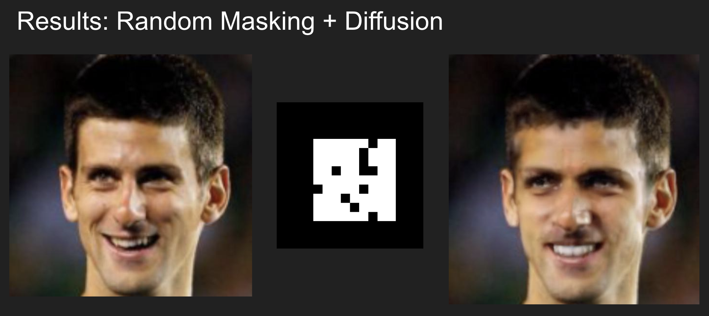
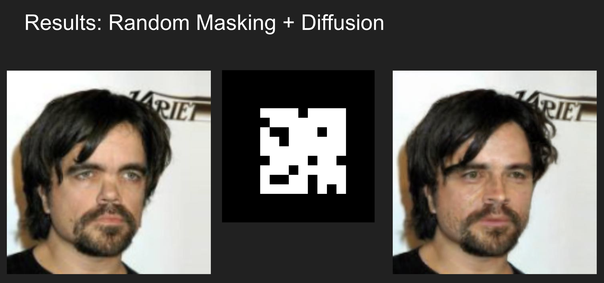
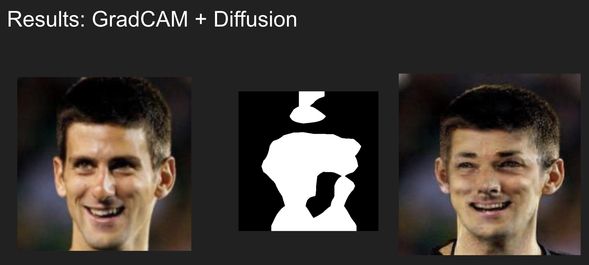
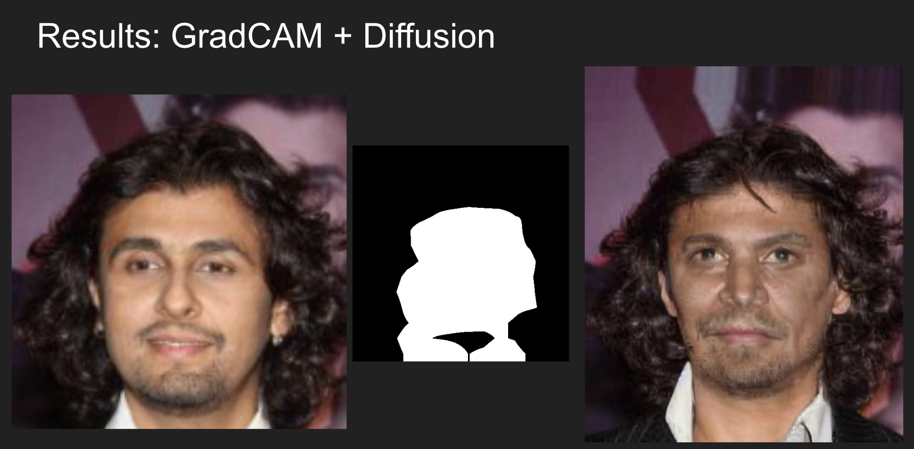
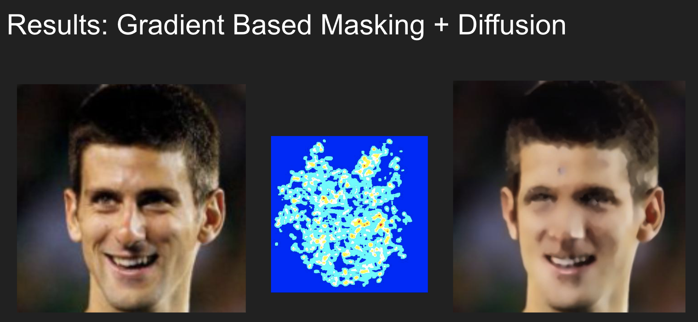
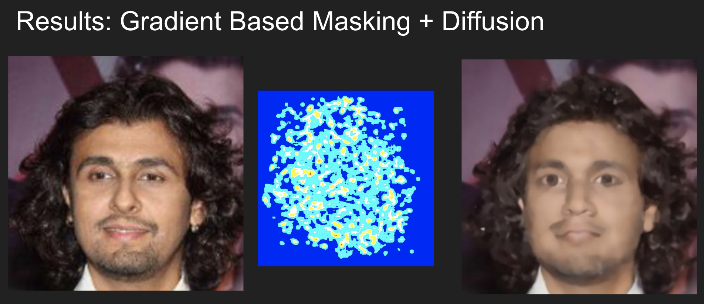

# Seeing is not believing! 
## Privacy preservation using intelligent masking and inpainting using stable diffusion

### Structure

- `/pipeline/facenet_finetuning.ipynb` : This notebook does fine-tuning of facenet over the celeb-A dataset. The facenet model available publicly has been trained over the VGGFace2 model and the CASIA-webface model. Since our diffusion models have been trained on celeb-A dataset, we finetuned the model over celeb-A dataset. Since we ran this code as a script on GCP, there are no inline outputs.

### Results

